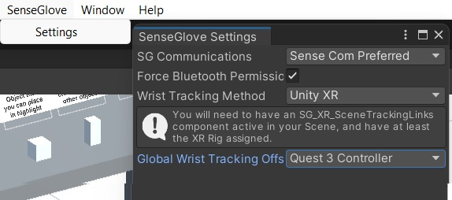
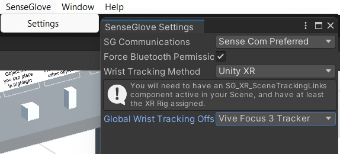
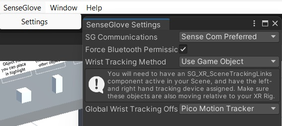

# Unity-Template

### Overview
A Template / example project that has been set up with the SenseGlove Unity Plugin and relevant VR Plugins. Useful when you're getting started.
There are some simple examples inside the Scenes/Examples_Scene.

This Template was created using Unity 2022.3.62f3, SenseGlove Unity Plugin v2.9.0

More information about the SenseGlove Unity SDK can be found at: https://senseglove.gitlab.io/SenseGloveDocs/

### Scenes

Example scene:
The interactions are made with Unity primitives to give an idea of how to work with the SenseGlove plugin. 
Interactions included are:
    - Simple interactions (grabbing, squeezing, placing inside highlight, breakable)
    - Advanced interactions (drawer, door)
    - Snapping interactions (drill example with trigger)
    - Buttons, switches and dials

Template scene:
A scene with the camera setup and the gloves placed.

Small objects scene:
A scene with a basic and crude example of how it could work if you have a lot of small objects and want to try to pick them up with the SenseGlove hands.

### Teleporting

Inside the Examples_Scene you can teleport around by pointing with your index finger to the spot you want to go.
The pointing works gesture based and can always be adjusted to another gesture.
If a green beam shows up a timer goes off and if the timer is complete you will teleport to the spot on the ground where the green beam hits the floor.
If the red beam shows up then the timer will reset and not start as that point is not allowed to teleport to.

### Setting up for each headset

For every headset there is a different setting that needs to be set so the tracking is working correctly.
Those settings are to be found in the topbar of Unity in the SenseGlove Settings. Those settings are set for the whole project not just for each scene.

**Meta Quest 3:** For the Quest 3 headset you have to set the settings to:

  

**Vive wrist trackers:** If you are using a headset with the Vive wrist trackers for the tracking then use:

  

**Pico Neo Motion trackers:** If using a Pico headset you have to do some other actions next to these settings:

  

You also have to setup the Pico controllers as a gameobject. Examples of this can be found in the Pico scenes in the project.
  

[!NOTE] Next to these settings also the different headset needs to be activated in the Unity XR plug-in management in the Unity project settings.
